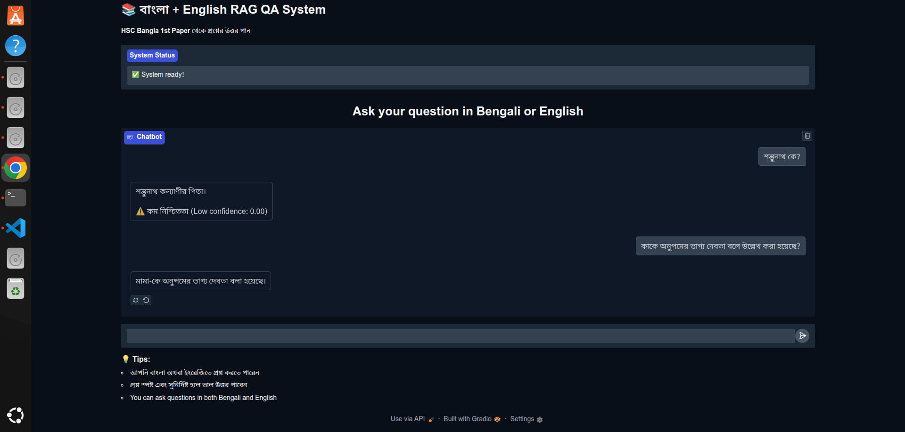
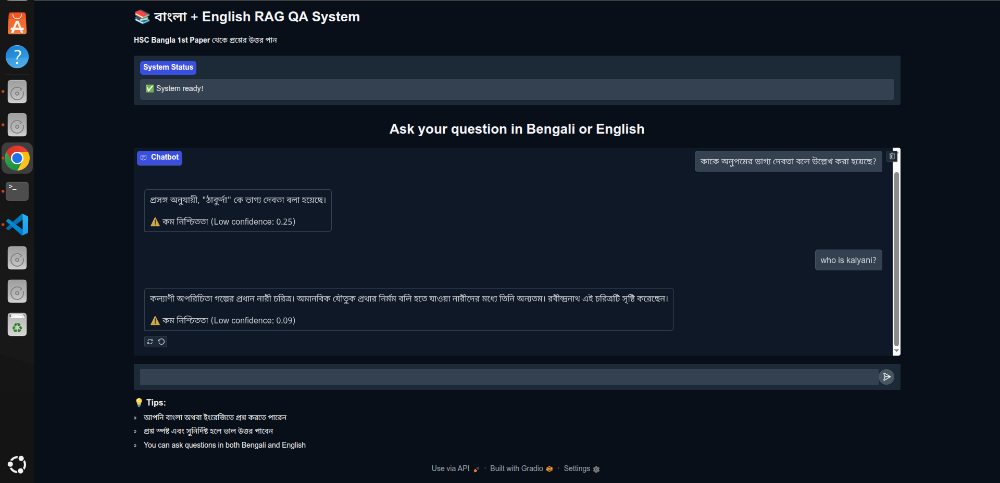
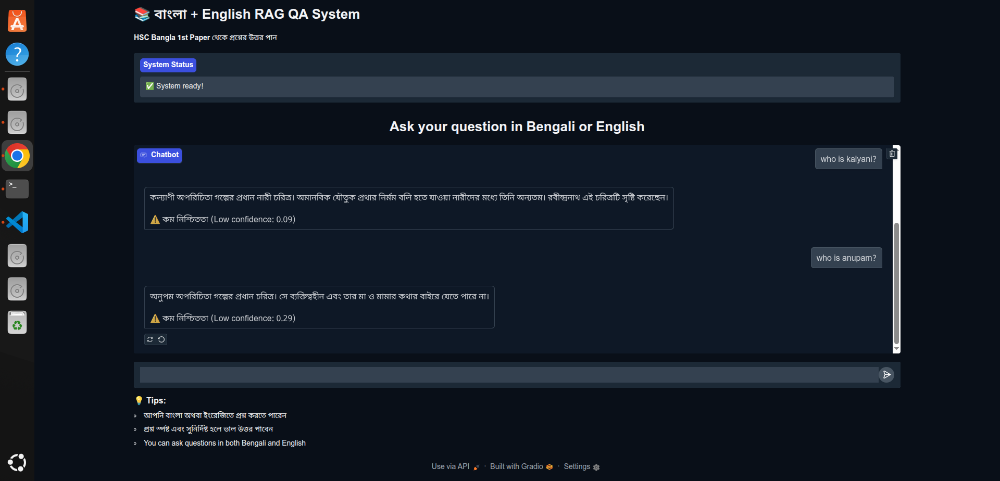
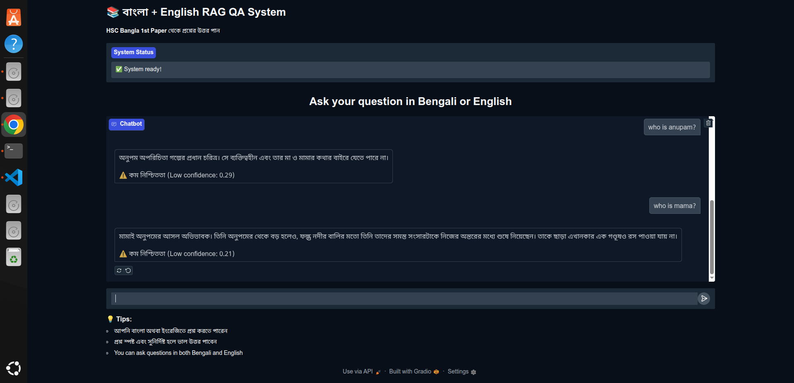
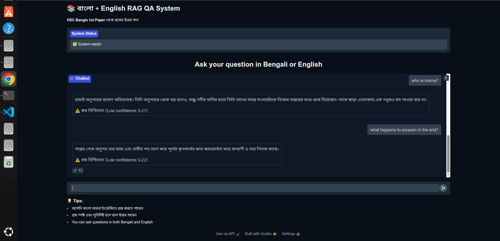
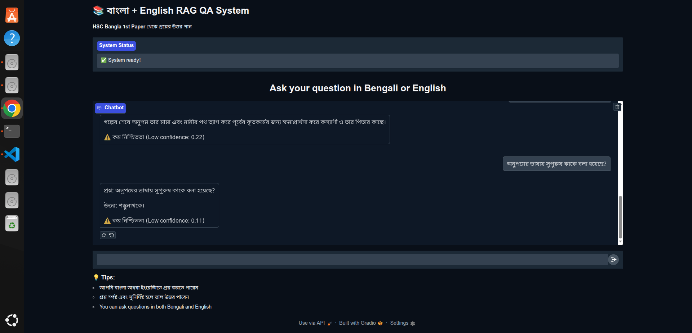
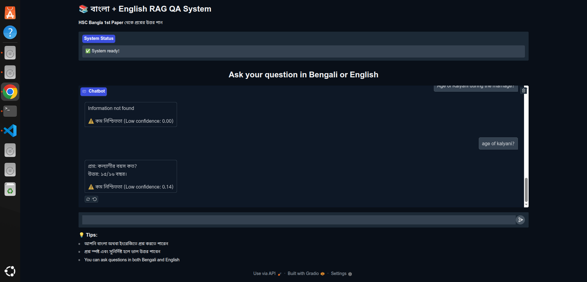

# 📚 Multilingual RAG System for HSC Bangla 1st Paper

This project implements a Retrieval-Augmented Generation (RAG) system designed to answer questions in both Bengali and English, leveraging the content of the HSC Bangla 1st Paper PDF textbook. It features intelligent text processing, an optimized vector store, and a robust RAG pipeline powered by the Gemini 1.5 Flash model. The system provides both a Gradio web interface and a lightweight FastAPI for programmatic access.

## ✨ Features

- **Multilingual Support**: Answers queries in both Bengali and English
- **Intelligent PDF Processing**: Extracts text from PDFs, removes headers/footers, and performs smart chunking to preserve semantic coherence
- **Semantic Retrieval**: Uses the state-of-the-art BAAI/bge-m3 embedding model for highly relevant context retrieval
- **Persistent Vector Store**: Utilizes ChromaDB to store document embeddings, avoiding reprocessing the PDF on every run
- **Gemini LLM Integration**: Leverages the Gemini 1.5 Flash model for generating concise and accurate answers based on retrieved context
- **Confidence Scoring**: Provides a confidence score for each answer, indicating the system's certainty
- **Source Attribution**: Includes page numbers and snippets from the source document for transparency
- **Conversation History**: Maintains chat history for multi-turn interactions
- **User-Friendly Web Interface**: A Gradio application for easy interaction
- **Lightweight REST API**: A FastAPI endpoint for programmatic access and integration with other applications
- **Configurable Parameters**: Centralized Config class for easy tuning of chunking, retrieval, and LLM parameters

## 🚀 Setup and Installation

Follow these steps to get the system up and running on your local machine.

### Prerequisites

- Python 3.9+ (recommended for best compatibility)
- Git (optional, for cloning the repository)
- A Google Cloud Project with the Gemini API enabled and an API Key

### Step-by-Step Installation

1. **Clone the Repository**:

   ```bash
   git clone git@github.com:1morshed1/Multilingual-RAG-System.git
   cd Multilingual-RAG-System
   ```

2. **Create a Virtual Environment**:
   It's highly recommended to use a virtual environment to manage dependencies.

   ```bash
   python3 -m venv venv
   ```

3. **Activate the Virtual Environment**:

   - **On macOS/Linux**:

     ```bash
     source venv/bin/activate
     ```

   - **On Windows (Command Prompt)**:

     ```cmd
     venv\Scripts\activate.bat
     ```

   - **On Windows (PowerShell)**:
     ```powershell
     venv\Scripts\Activate.ps1
     ```

4. **Install Dependencies**:
   Install all required Python packages using pip:

   ```bash
   pip install -r requirements.txt
   ```

5. **Place your PDF**:
   Ensure your `hsc_bangla1.pdf` file is located in the `pdfs/` directory relative to your project root. If the `pdfs` directory doesn't exist, create it:

   ```bash
   mkdir pdfs
   # Then place your PDF inside pdfs/
   ```

6. **Set up Gemini API Key**:
   Create a `.env` file in the root of your project and add your Gemini API Key:

   ```
   GEMINI_API_KEY="YOUR_GEMINI_API_KEY_HERE"
   ```

   Replace `"YOUR_GEMINI_API_KEY_HERE"` with your actual API key.

## 🏃 How to Run

### 1. Initialize the RAG System (Process PDF and Build Vector Store)

The RAG system will automatically initialize and process the PDF on its first run (either via Gradio or FastAPI startup). If you make changes to the PDF or chunking strategy, you might need to force a rebuild.

To force a rebuild (e.g., if you update the PDF or Config parameters related to chunking):

1. Delete the existing ChromaDB: Remove the `./chromadb` directory from your project root.

   ```bash
   rm -rf ./chromadb # On Linux/macOS
   # rmdir /s /q .\chromadb # On Windows Command Prompt
   ```

2. Then, run either the Gradio app or FastAPI, and it will rebuild the vector store.

### 2. Gradio Web Interface

For a user-friendly chat interface:

```bash
python gradio_app.py
```

After running, open the URL displayed in your terminal (e.g., `http://0.0.0.0:7860` or a public Gradio Share URL) in your web browser.

### 3. FastAPI REST API

To expose the RAG system as a RESTful API for programmatic interaction:

```bash
uvicorn api:app --host 0.0.0.0 --port 8000 --reload
```

After running, you can access:

- **Interactive API Documentation (Swagger UI)**: `http://127.0.0.1:8000/docs`
- **ReDoc Documentation**: `http://127.0.0.1:8000/redoc`
- **Root Endpoint (Welcome Message)**: `http://127.0.0.1:8000/`

## 📊 API Documentation (FastAPI)

### Endpoints

**`GET /`**: Returns a welcome message to confirm the API is running.

- **Response**: `{"message": "Welcome to the Multilingual RAG System API! Visit /docs for API documentation."}`

**`POST /query`**: Processes a user query using the RAG system and returns a model-generated answer.

**Request Body** (`application/json`):

```json
{
  "query": "string",
  "conversation_history": [
    {
      "role": "user",
      "content": "string"
    },
    {
      "role": "assistant",
      "content": "string"
    }
  ]
}
```

- `query` (string, required): The user's current question in Bengali or English
- `conversation_history` (array of objects, optional): Previous turns of the conversation. Each object should have a `role` ("user" or "assistant") and `content` (the message text)

**Response Body** (`application/json`):

```json
{
  "query": "string",
  "answer": "string",
  "language": "string",
  "confidence": 0.0,
  "sources": [
    {
      "page_number": "string",
      "snippet": "string",
      "chapter": "string"
    }
  ],
  "context_count": 0,
  "error": "string"
}
```

- `query` (string): The original query
- `answer` (string): The generated answer
- `language` (string): Detected language of the query (bn or en)
- `confidence` (float): Confidence score (0.0 to 1.0)
- `sources` (array of objects): Metadata about the retrieved chunks
- `context_count` (integer): Number of context chunks used
- `error` (string, optional): Error message if an issue occurred

### Example curl Request

```bash
curl -X POST "http://127.0.0.1:8000/query" \
 -H "Content-Type: application/json" \
 -d '{
"query": "অনুপমের ভাষায় সুপুরুষ কাকে বলা হয়েছে?",
"conversation_history": []
}'
```

## ⚙️ Configuration

All tunable parameters are centralized in the `config.py` file within the `Config` class. Key configurable aspects include:

### Core Configuration

- **API Keys**: `GEMINI_API_KEY`
- **File Paths**: `PDF_PATH`, `VECTOR_DB_PATH`, `BACKUP_DB_PATH`

### Text Processing

- **Chunking**: `CHUNK_SIZE`, `OVERLAP`, `MIN_CHUNK_SIZE`, `MAX_SENTENCE_LEN_FOR_SPLIT`, `OVERLAP_SENTENCE_COUNT`
- **Layout Processing**: `HEADER_HEIGHT_PERCENTAGE`, `FOOTER_HEIGHT_PERCENTAGE`
- **Quality Control**: `MIN_BENGALI_PERCENTAGE`, `MAX_PUNCTUATION_RATIO`

### Vector Database

- **Model**: `EMBEDDING_MODEL` (default: `BAAI/bge-m3`)
- **Database**: `VECTOR_DB_NAME`

### Retrieval Settings

- **Basic Retrieval**: `TOP_K_RETRIEVAL`, `SIMILARITY_THRESHOLD`, `RERANK_TOP_K`
- **Adaptive Retrieval**: `ADAPTIVE_RETRIEVAL`, `MIN_RETRIEVAL`, `MAX_RETRIEVAL`

### Performance & Memory

- **Limits**: `MAX_CHAT_HISTORY`, `CONTEXT_WINDOW`, `MAX_TOKENS_PER_REQUEST`
- **Concurrency**: `BATCH_SIZE`, `MAX_CONCURRENT_REQUESTS`, `CACHE_SIZE`

### Quality Control

- **Answer Quality**: `MIN_ANSWER_CONFIDENCE`, `FALLBACK_THRESHOLD`, `MAX_ANSWER_LENGTH`
- **Source Attribution**: `INCLUDE_SOURCES`, `SOURCE_SNIPPET_LENGTH`

### Advanced Features

- **Debug**: `DEBUG_MODE`, `LOG_LEVEL`
- **Enhancements**: `ENABLE_QUERY_EXPANSION`, `ENABLE_SPELL_CHECK`
- **Gemini Parameters**: `GEMINI_PARAMS` (temperature, top_p, top_k, safety settings)

## 📁 Project Structure

```
MULTILINGUAL-RAG-SYSTEM/
   └── images/
   ├── pdfs/
   │   └── hsc_bangla1.pdf
   ├── .env
   ├── main.py
   ├── gradio_app.py
   ├── api.py
   ├── config.py
   ├── preprocess.py
   ├── rag_pipeline.py
   ├── vector_store.py
   └── requirements.txt
```

## ❓ System Design and Implementation Details

### 1. Text Extraction Method

**Method/Library**: The system uses `pdfplumber` to extract text from PDF documents.

**Why pdfplumber?**

- Highly effective at extracting text while preserving layout information, including word bounding boxes and table structures
- Crucial for accurately removing headers and footers, which appear at consistent vertical positions
- Allows extraction of tables as structured data for separate processing or integration

**Formatting Challenges**:

- **Headers and Footers**: Running titles, page numbers, and recurring elements. The `_reconstruct_text_from_words` method filters out words within predefined header/footer height percentages (`HEADER_HEIGHT_PERCENTAGE`, `FOOTER_HEIGHT_PERCENTAGE`)
- **Multi-column Layouts**: Text flowing across multiple columns. The system reconstructs reading order by sorting words by top then x0 coordinates and heuristically adding spaces/newlines
- **Tables**: Extracted using `pdfplumber.extract_tables()` for structured data
- **OCR Errors**: The `clean_bengali_text` method includes Unicode normalization, OCR-specific fixes, and extensive regex patterns to clean up garbled characters

### 2. Chunking Strategy

**Strategy**: Intelligent sentence-based chunking with configurable overlap, implemented in `smart_chunk_text` and `_create_semantic_chunks` methods within `preprocess.py`.

**How it Works**:

- **Sentence Splitting**: Splits text into sentences using Bengali punctuation (`।`, `.`, `!`, `?`) and paragraph breaks
- **Long Sentence Handling**: For sentences exceeding `MAX_SENTENCE_LEN_FOR_SPLIT`, applies heuristic splitting at Bengali conjunctions or discourse markers
- **Dynamic Chunk Building**: Sentences are iteratively added to chunks
- **Configurable Overlap**: New chunks include `OVERLAP_SENTENCE_COUNT` sentences from the previous chunk
- **Fallback Strategy**: Uses word-based windowing (`_create_word_windows`) if no sentences are detected
- **Post-processing**: Merges small trailing chunks (below `MIN_CHUNK_SIZE`) with subsequent chunks

**Why it Works Well**:

- **Semantic Coherence**: Sentences are natural meaning units, allowing embeddings to capture complete thoughts
- **Context Preservation**: Sentence-based overlap ensures information spanning chunks remains accessible
- **Query Alignment**: Users typically ask about facts expressed within sentences, improving retrieval relevance
- **LLM Optimization**: Coherent chunks reduce noise and focus LLM attention on relevant content
- **Tunability**: All parameters configurable via `Config` class for optimization

### 3. Embedding Model

**Model**: `BAAI/bge-m3` (specified in `Config.EMBEDDING_MODEL`), loaded via the sentence-transformers library.

**Why This Model?**

- **State-of-the-art Performance**: BGE-M3 is known for strong performance in retrieval tasks across multiple languages, including Bengali
- **Multilingual Capability**: Specifically designed for cross-language semantic understanding
- **Retrieval Optimization**: Optimized for information retrieval tasks, making it ideal for RAG systems

**How it Captures Meaning**:

- **Vector Space Representation**: Converts text into high-dimensional numerical vectors (embeddings)
- **Semantic Proximity**: Texts with similar meanings map to nearby points in vector space
- **Training Objective**: Trained on massive datasets using tasks that force learning of semantic relationships between words and phrases
- **Cross-lingual Alignment**: Learns shared semantic space across languages, enabling English queries to match Bengali content meaningfully

### 4. Query-Chunk Comparison

**Method**: Cosine similarity on vector embeddings, configured in `OptimizedVectorStore` with `metadata={"hnsw:space": "cosine"}`.

**Process**:

1. Query converted to embedding using BAAI/bge-m3 model
2. Query embedding compared against all stored chunk embeddings in ChromaDB
3. Cosine similarity measures angle between vectors (1 = perfect similarity, 0 = no similarity, -1 = opposite)
4. `TOP_K_RETRIEVAL` most similar chunks initially retrieved
5. **Re-ranking**: `_rerank_candidates` function applies additional heuristics:
   - Exact keyword matches from query
   - Named entities present in query
   - Dialogue markers for conversational queries

**Why This Setup?**

- **Semantic Focus**: Cosine similarity captures semantic closeness regardless of text length
- **Length Normalization**: Inherently normalizes for text length differences
- **Persistent Storage**: ChromaDB's `PersistentClient` saves embeddings to disk, avoiding reprocessing
- **Efficient Search**: Optimized for Approximate Nearest Neighbor (ANN) search
- **Metadata Integration**: Stores metadata alongside embeddings for enhanced re-ranking

### 5. Handling Vague Queries

**Meaningful Comparison Mechanisms**:

- **Multilingual Semantic Embeddings**: BAAI/bge-m3 maps semantically similar texts to nearby vector space points, even across languages
- **Intelligent Chunking**: Semantic coherence ensures each chunk contains meaningful, complete information units
- **Multi-faceted Re-ranking**: `_rerank_candidates` prioritizes chunks with exact keyword matches, named entities, and dialogue markers
- **Contextual Prompting**: RAGPipeline constructs prompts with explicit context and instructions to answer only from provided information
- **Confidence Scoring**: `_estimate_confidence` calculates overlap between generated answers and retrieved contexts

**Vague Query Response Strategy**:

- **Retrieval Impact**: Vague queries may retrieve loosely related or broad-topic chunks
- **LLM Safeguards**: System prompt instructs Gemini to respond with "এই তথ্য পাওয়া যায়নি" (Information not found) when context is insufficient
- **Confidence Indication**: Low confidence scores (approaching 0.0) for unclear or hallucinated answers
- **Adaptive Retrieval**: Config includes `ADAPTIVE_RETRIEVAL`, `MIN_RETRIEVAL`, and `MAX_RETRIEVAL` parameters for dynamic chunk retrieval based on query complexity
- **User Feedback Loop**: "Information not found" responses prompt users to refine their questions

### 6. Improving Relevance

**Current System Strengths**: The robust design (BGE-M3, semantic chunking, re-ranking, contextual prompting, confidence scoring) should provide highly relevant results for queries answerable within the source document.

**Enhancement Strategies**:

**Advanced Chunking**:

- **Hierarchical Chunking**: Multi-granularity chunking (paragraphs, sections, sentences) for different detail levels
- **Content-Aware Chunking**: Structure-based chunking using headings, subheadings, and document markers
- **Table-Specific Processing**: Extract tables as structured JSON/Markdown for specialized table queries

**Enhanced Embeddings**:

- **Domain Fine-tuning**: Fine-tune embedding models on Bengali literature or HSC curriculum datasets
- **Larger Training Corpora**: Models trained on broader, more diverse Bengali text corpus for better literary nuance understanding

**Knowledge Base Expansion**:

- **Comprehensive Sources**: Add related textbooks, study guides, and literary analyses to expand answerable queries
- **Multi-document Integration**: Process multiple PDFs to create a comprehensive knowledge base

**Advanced Retrieval Techniques**:

- **Hybrid Search**: Combine semantic (vector) search with lexical (BM25/TF-IDF) search using Reciprocal Rank Fusion (RRF)
- **Cross-encoder Re-ranking**: Use dedicated cross-encoder models for query-document pair relevance scoring
- **Query Enhancement**: LLM-based query expansion with synonyms and rephrasing, query decomposition for multi-part questions

**System Optimization**:

- **LLM Fine-tuning**: Fine-tune smaller LLMs on Bengali Q&A datasets for domain-specific response quality
- **Iterative Improvement**: Continuous evaluation and refinement based on failure case analysis

## 📊 Evaluation and Confidence Estimation

The system includes heuristic-based confidence estimation in `rag_pipeline.py`:

```python
def _estimate_confidence(self, answer: str, contexts: List[Dict]) -> float:
    """
    Simple confidence estimation based on keyword overlap between the generated
    answer and the retrieved context. Returns 0.0 if the answer explicitly
    states "Information not found".
    """
    if not answer or "তথ্য পাওয়া যায়নি" in answer or "not found" in answer.lower():
        return 0.0

    # Check if answer contains specific information from context
    answer_words = set(answer.lower().split())
    context_words = set()
    for ctx in contexts:
        context_words.update(ctx['text'].lower().split())

    overlap = len(answer_words.intersection(context_words))
    total_answer_words = len(answer_words)

    return min(overlap / max(total_answer_words, 1), 1.0)
```

### Confidence Metrics

- **Score Range**: 0.0 to 1.0
- **Interpretation**:
  - 0.0: LLM explicitly stated "Information not found" or answer was empty
  - Higher scores: Greater lexical overlap indicating more "grounded" answers based on retrieved context

## Demo









## 🤝 Contributing

Contributions are welcome! Please feel free to open issues or submit pull requests to improve the system.

## 📄 License

This project is open-source and available under the MIT License.

---

This documentation provides a comprehensive guide to understanding, setting up, and using the Multilingual RAG System for HSC Bangla 1st Paper. The system combines advanced NLP techniques with practical usability to deliver accurate, contextually relevant answers in both Bengali and English.
